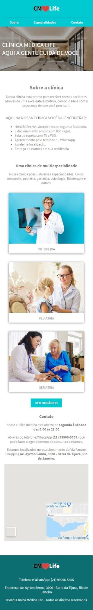
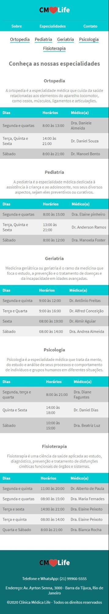

<h1>CMLife</h1>
<h3>Site responsivo às telas de resolução:</h3>
<ul>
  <li>Mobile: até 425px</li>
  <li>Tablet: de 426px até 768px</li>
  <li>Desktop: de 769px até 1024px</li>
  <li>Desktop: acima de 1024px</li>
</ul>

<h2>Layouts Mobile</h2>

<h3>OBS: Os outros Layouts estão na pasta 'layouts' no repositório.</h3>

<ul>
    <caption>
        <h3>Tecnologias utilizadas:</h3>
    </caption>
    <li>React Js</li>
    <li>Html Semântico</li>
    <li>CSS</li>
    <li>Flexbox</li>
    <li>Resposividade</li>
    <li>Efeitos visuais</li>
    <li>Tabelas Estilizadas</li>
    <li>Navegção entre páginas</li>
    <li>Editor de código: VSCode</li>
</ul>

<h3>Desenvolvido por: <a href="https://www.linkedin.com/in/montemarcos/" target="_blank">Marcos Monte</a></h3> 
